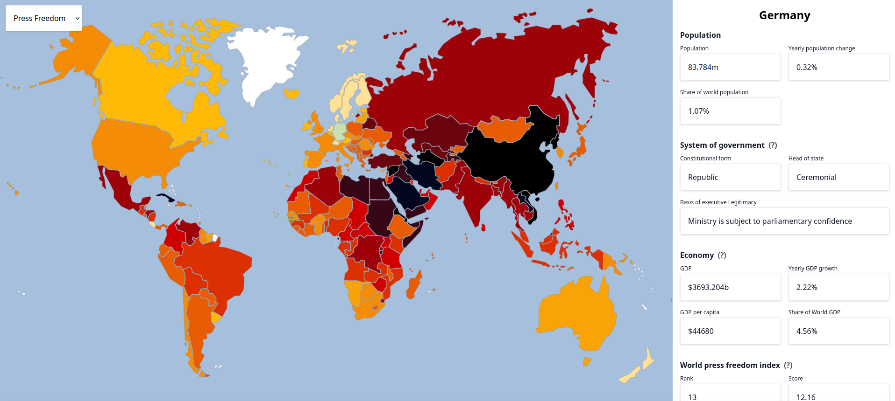

#### Setup
- `yarn install`
- `yarn compile-tailwind`

#### TODO
- [ ] make barometer collapsible 
- [ ] add news
- [ ] add world wide information - https://www.worldometers.info/
- [ ] add more information for country (e.g. GDP)
